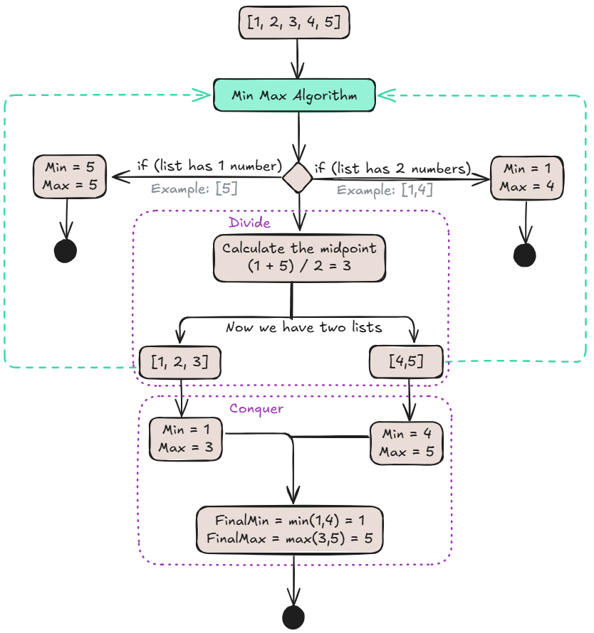

# Simultaneous Min Max study
In this file I tried to understand the recursion behind the Simultaneous Min Max algorithm before implementing it in Python or any other programming language.

To explain the algorithm, I did a step by step diagram in Excalidraw. Check it out.

Let's say we start with the list of numbers [1,2,3,4,5].

This code uses a Divide and Conquer approach to find the minimum and maximum values in a list. Here's how it works, step by step:

1. **Divide the list (Divide)**: the algorithm first splits the list in half. This is done by finding the midpoint.
2. **Recursive calls (Conquer)**: it then calls itself recursively for each of the two halves. This process repeats, dividing each new sub-list in half until it reaches the simplest possible cases:

- A list with just one number. In this case, the number is both the minimum and the maximum.
- A list with two numbers. It simply compares them to find the minimum and maximum of that pair.

3. **Combine results**: after the recursive calls return, the algorithm starts to combine the results from the smaller sub-lists. It takes the maximums from the two halves and finds the overall maximum. It does the same for the minimums.

This process of dividing, solving the small parts, and combining the results continues until the very first function call returns, giving you the minimum and maximum values for the entire original list. The key is that it avoids iterating through the list multiple times, which makes it more efficient.